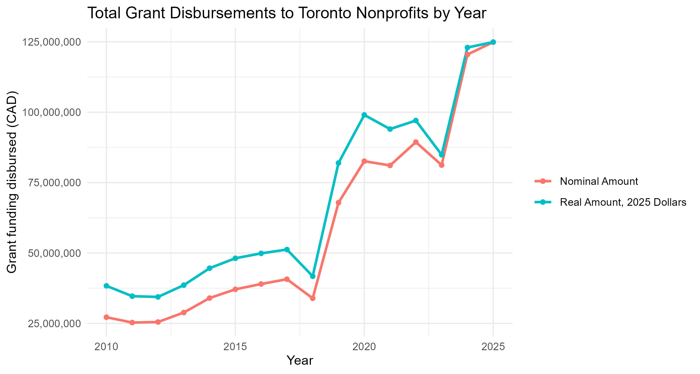
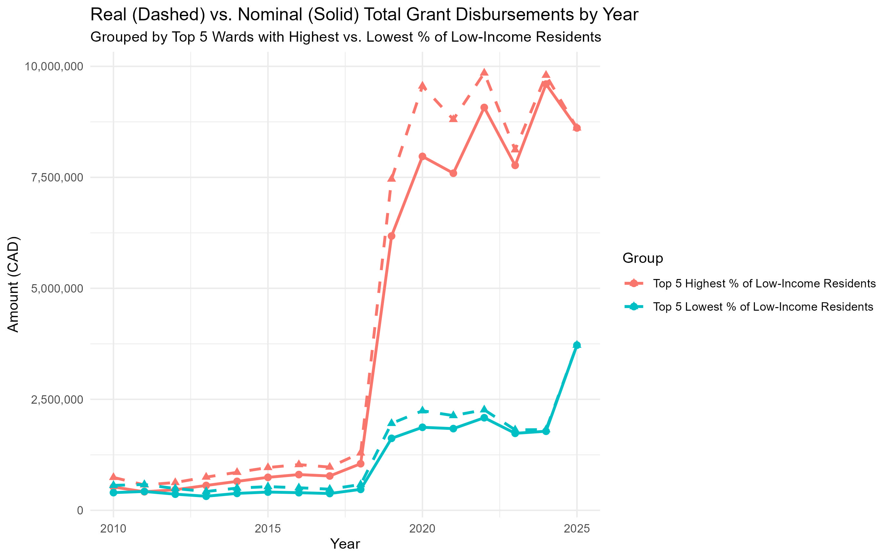
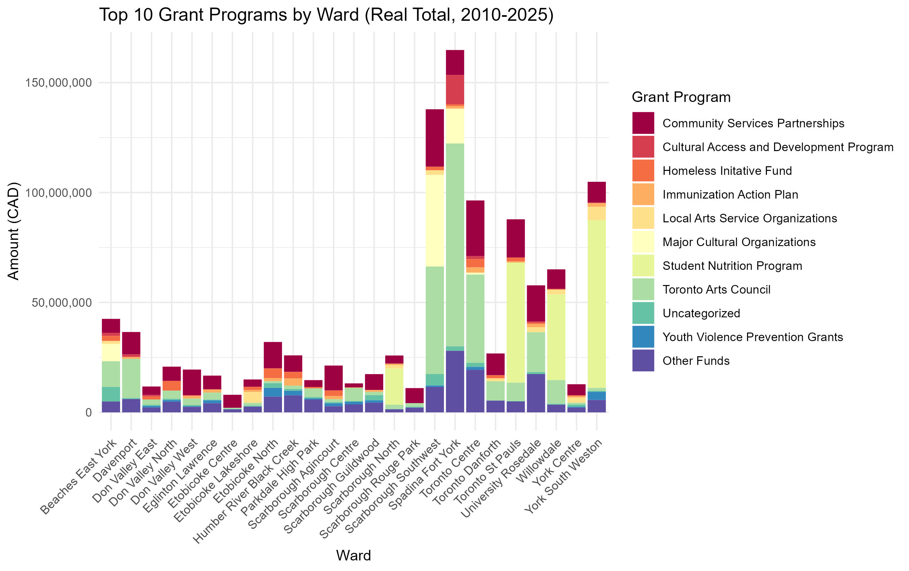
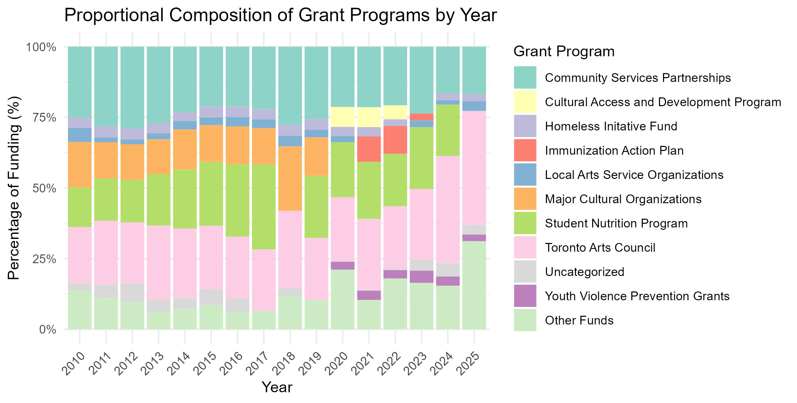
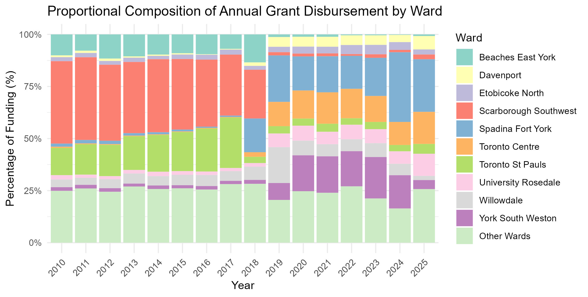
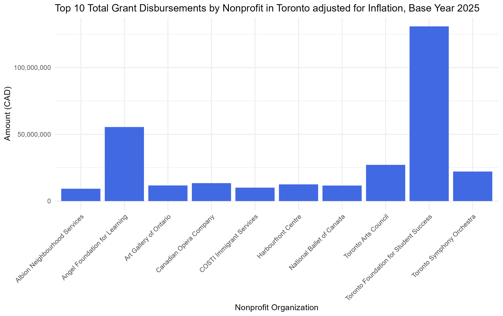

```{r}
#| include: false
#| warning: false
#| message: false

library(tidyverse)
library(dplyr)
library(knitr)
library(ggplot2)
library(tinytex)
library(tinytable)
library(readr)
library(stringr)

```

# Introduction

The City of Toronto approves grant programs and funding for various nonprofit organizations, grassroots groups, collectives, and charities through its Community Partnership Investment Program. Currently, data on 2010 to 2025 grant disbursements are available at Open Data Toronto [@city_of_toronto_community_2026]. These nonprofits serve a wide range of causes, with smaller groups and charities (defined as having <$500,000 in annual revenue) often tailoring their services for their local communities [@toronto_foundation_goodtogive2024_nodate]. In contrast to mainstream institutions, which may be hindered by bureaucracy, smaller nonprofits are more flexible in times of crisis, ensuring that vulnerable individuals who do not qualify for mainstream support still receive help [@bennett_role_2024]. However, federal cuts in core funding from the 1990s onward in addition to increasing costs have left many competing for short-term grants. These applications prioritize one-time initiatives and thus make it difficult for nonprofits to accomplish long-term goals [@scott_funding_2003]. In 2023, more than 74% of nonprofits and grassroots groups reported a year-over-year increase in demand for their services, with 31% forecasting insolvency within a year [@ayer_torontos_2023]. These concerns continue to mount even as the City of Toronto expands grant funding to support the nonprofit sector [@campbell_selected_2022; @chu_2019_2019; @social_planning_toronto_2026_2026].

As such, this paper analyzes changes in grant funding from 2010-2025 to see where allocations and nonprofits' needs may potentially be misaligned. In particular, we investigate whether funding has increased to account for inflation, how the composition of total funding has changed over the years, and how grant funding impacts the most vulnerable neighbourhoods, measured through the LIM-AT, or low-income measurement after-tax threshold as defined by Statistics Canada [@statistics_canada_dictionary_2021]. This information could potentially be used to inform municipal policy and better support smaller nonprofits in the future.

After adjusting for inflation using 2025 as the base year, we found that funding did increase over this time period, specifically during COVID-19 and from 2023 onwards, when the municipal government approved additional funding given the integral role nonprofits played in supporting Torontonians during the pandemic, alongside targeted investments for arts organizations [@city_of_toronto_agenda_2023; @shuriye_advancing_2025]. However, funding fluctuated substantially during the pandemic, an effect disproportionately affecting wards with the highest proportion of LIM-AT households. This instability undermines service continuity; without a dependable baseline of income, grassroots organizations struggle to provide consistent support. Furthermore, the composition of grant funding has shifted, with a greater proportion of funding now geared towards arts organizations. There also seems to be a growing percentage of smaller grant programs. While microgrants can reduce direct competition by targeting niche needs, it simultaneously creates a heavy administrative burden. For under-resourced nonprofits, navigating numerous applications and administrative requirements further strains staff and takes time away from providing core services. Ultimately, consolidating funding into larger, more streamlined grant programs with broader eligibility criteria may better serve the sector by reducing administrative burdens while ensuring long-term financial stability.

In the following sections, @sec-data describes the datasets and variables used in the analysis, @sec-results summarizes major findings, and @sec-discussion interprets results from the analysis and discusses its limitations.

# Data {#sec-data}

## Community Grant Allocations Data

The main dataset used is Open Data Toronto's Community Grant Allocations from the opendatatoronto library [@gelfand_opendatatoronto_2025]. The dataset is updated yearly and tracks city-approved grant funding to nonprofits via their Community Partnership Investment Program (CPIP) [@city_of_toronto_community_2026]. The final dataset can be seen in @tbl-data. A second dataset on Toronto's 25-ward system was also used, seen in @tbl-wards [@city_of_toronto_ward_2024].

The entirety of this project was done in R [@r_core_team_r_2024]. For data cleaning and preparing the final deliverables, the following libraries were used: priceR [@condylios_pricer_2026], dplyr [@wickham_dplyr_2023], stringR [@wickham_stringr_2023], readR [@wickham_readr_2024], tidyverse [@wickham_tidyverse_2023], validate [@loo_validate_2025], tinytable [@arel-bundock_tinytable_2026], tinytex [@xie_tinytex_2019], bit64 [@oehlschlagel_bit64_2020], scales [@wickham_scales_2025], ggplot2 [@wickham_ggplot2_2025], and knitr [@xie_knitr_2025].

Within the raw data, years 2010 to 2021 are listed in separate datasets, while years 2022 to 2025 are in one dataset. Moreover, datasets 2010 to 2017 are in wide format, whereas datasets from 2018 onward are in long format. Sample entries from 2010, 2018, and 2022-2025 datasets are provided in @sec-appendix in @tbl-raw2010, @tbl-raw2018 and @tbl-raw2225, respectively. All datasets contain information on the nominal grant amount, grant program code, organization name, ward number or name, and service area. Some datasets had additional information such as the number of grant installments. Since the reporting format evolved over the time period, a decision was made to transform wide-formatted datasets into long-format for ease of analysis. To ensure consistent analysis, two master reference tables were made. First, to account for municipal ward rezoning to the 25-ward system after 2018, historical organization records were mapped to align ward numbers and full names consistently, which can be found in @tbl-orgs in @sec-appendix [@city_of_toronto_ward_2024]. Secondly, to address inconsistent or missing grant program codes, names, and descriptions, program information was aggregated across all datasets into a master fund file (@tbl-funds in @sec-appendix), with manual imputation for retired grants [@city_of_toronto_arts_2017, @city_of_toronto_indigenous_2017; @city_of_toronto_indigenous_2025; @city_of_toronto_local_2017; @city_of_toronto_indigenous_2023; @city_of_toronto_black-mandated_2024; @city_of_toronto_homelessness_2022; @city_of_toronto_confronting_2017; @city_of_toronto_toronto_2022; @city_of_toronto_toronto_2017; @city_of_toronto_community_2017-1; @city_of_toronto_indigenous_2019; @city_of_toronto_housing_2021; @city_of_toronto_youth_2022; @onha_social_nodate; @rpna_funding_nodate]. These had to be created given that no such files were available. Grant programs whose full names could not be verified were put in an "Uncategorized" category.

The resulting clean, amalgamated dataset in @tbl-data standardizes the geographic locations of Toronto's nonprofit organizations. In addition to inflation-adjusting all allocations to 2025 dollars using priceR [@condylios_pricer_2026], the final dataset incorporates the following variables for analysis: the disbursement year, recipient nonprofit organization, current ward number and name, specific grant program code and full name, nominal grant amounts, and the designated service area (local, city, or neighbourhood). While service area was ultimately not used in the data analysis, it served as an extra variable to cross-reference and match records when merging datasets.

```{r, echo=FALSE}
#| label: tbl-data
#| tbl-cap: "Clean dataset amalgamated from 2010-2025 Community Grant Allocations Data"
#| warning: false

data <- read.csv("../data/02-analysis_data/clean_data.csv", header = TRUE)

data <- data[2, 1:10] |> mutate(servicearea = service_area, grant = grant_amount, code=grant_code, wardnum = ward_number, real =round(infl_adj_funding,2), full=Full.Name.Final) |> select(-c(service_area, ward_number, grant_amount,grant_code, Full.Name.Final,infl_adj_funding)) |> #select(-real) |>
  rename("ID" = X,
         "Year" = year,
         "Organization" = organization,
         "Service Area" = servicearea,
         "Grant" = code,
         "Full Name" = full,
         "Ward Number" = wardnum,
         "Ward Name" = Ward.Name,
         "Nominal Amount (CAD)" = grant,
         "Real Amount (CAD)" = real)

tt(data, width=8) |> style_tt(fontsize = 0.6)
```

## 25-Ward System

To standardize ward numbers and names, a dataset listing the 25 ward names and numbers was downloaded from Open Data Toronto, shown in @tbl-wards [@city_of_toronto_ward_2024, @gelfand_opendatatoronto_2025]. Notably, these were useful when imputing the ward names in the cleaned dataset after organizations' ward numbers were updated to the 25-ward system. There are 2 other datasets including demographic and income data by ward which were referenced when determining the percentage of LIM-AT households in each ward [@city_of_toronto_ward_2024].

```{r, echo=FALSE}
#| label: tbl-wards
#| tbl-cap: "Ward Names and numbers under Toronto's 25-ward system"
#| warning: false

master_wards <- read.csv("../data/02-analysis_data/master_wards.csv")
master_wards <- master_wards |> slice(1:3) |> mutate(Ward.Name = str_replace_all(Ward.Name, "([a-z])([A-Z])", "\\1 \\2")) |>
  rename(
    "Ward Number" = Ward.Number,
    "Ward Name" = Ward.Name
  )
tt(master_wards)
```

# Results {#sec-results}

@fig-ex1 shows total grant disbursements year over year from 2010 to 2025, comparing nominal to real amounts adjusted for inflation with 2025 as the base year. In nominal dollars, total grant funding to Toronto nonprofits grew from just over \$25 million in 2010 to \$125 million in 2025. The real funding trend line in blue consistently outpaces the nominal trend due to past dollars having higher purchasing power. A notable decrease in funding occurs around 2018–2019, followed by a large surge during the pandemic years and subsequent fluctuations until nominal and real disbursements converge at $125 million in 2025. Overall, real purchasing power stagnated or dropped from 2010-2018 before increasing thereafter.

```{r, echo=FALSE}
#| label: fig-ex1
#| fig-cap: "Trajectory of Toronto nonprofit grant funding (2010-2025). Funding volatility is most prevalent during the pandemic, followed by significant growth from 2023 onward."
#| warning: false
#| out-width: "90%"



```

@fig-ex2 looks at grant disbursements with respect to the LIM-AT (Low-Income Measure, After Tax), which is used to assess whether a household meets low-income criteria as defined by the federal government based on household size [@statistics_canada_dictionary_2021]. The most vulnerable wards include Toronto Centre (Ward 13), Willowdale (Ward 18), University-Rosedale (Ward 11), Humber River-Black Creek (Ward 7), and York South-Weston (Ward 5), which have LIM-AT rates of 22.2%, 17.8%, 15.3%, 15.1%, and 14.7%, respectively. The five wards with the lowest proportion of LIM-AT households are Scarborough-Rouge Park (Ward 25), Etobicoke Centre (Ward 2), Eglinton-Lawrence (Ward 8), Davenport (Ward 9), and Etobicoke-Lakeshore (Ward 3), ranging from 7.8% to 11.0% [@city_of_toronto_ward_2024]. The high-LIM-AT ward group receives a higher total volume of funding; however, it also suffers much more volatility during crises such as the pandemic. In contrast, the lowest low-income wards experience more stability.

```{r, echo=FALSE}
#| label: fig-ex2
#| fig-cap: "Comparison of Grant Disbursements Among Top 5 Wards with the Highest and Lowest Proportion of LIM-AT Households from 2010-2025. LIM-AT (Low-Income Measure, After Tax) assesses if a household meets low-income criteria as defined by Statistics Canada, based on household size [@statistics_canada_dictionary_2021]."
#| warning: false
#| out-width: "80%"



```

@fig-ex3 examines the cumulative amount of grant funding each ward received from 2010 to 2025, aggregated in real dollars adjusted for inflation with 2025 as the base year, along with the composition of that grant funding. Notably, downtown and highly populated wards like Spadina-Fort York, Scarborough Southwest, York South-Weston, and Toronto Centre have cumulatively taken in the most grant funding, overwhelmingly from arts-based grants such as the Toronto Arts Council and Major Cultural Organizations, in addition to community-centred grants like Community Services Partnerships. Beaches-East York and Davenport also obtain most of their grant funding from the Toronto Arts Council. Wards like Willowdale, Toronto-St. Paul's, and Scarborough North are dominated by the Student Nutrition Program, while Community Services Partnerships appear more prevalent in other wards. Overall, examining the composition of grant funding in each ward reveals distinct local needs and the diverse missions of the organizations serving them.

```{r, echo=FALSE}
#| label: fig-ex3
#| fig-cap: "Cumulative real grant disbursements (2010–2025) across Toronto wards, broken down by top grant programs. Note the heavy concentration of Major Cultural Organizations and Toronto Arts Council funding in downtown wards compared to community-focused allocations elsewhere.'Other Funds' are smaller grant programs that are not in Top 10, while 'Uncategorized' refers to grant programs that have an acronym but not a full name provided in the data."
#| warning: false
#| out-width: "90%"


```

@fig-ex4 shows the proportional composition of grant funding by year in real dollars adjusted for inflation with 2025 as the base year. The time period is largely dominated by grant programs and funding organizations such as the Toronto Arts Council, the Student Nutrition Program, and Community Services Partnerships. Notably, funding from Major Cultural Organizations drops sharply during the pandemic years and does not recover to its previous scale. Meanwhile, Community Services Partnerships fluctuates, and Toronto Arts Council funding experiences noticeable relative growth from the pandemic years onward after being relatively consistent beforehand. Additionally, grants for youth violence prevention and "Other Funds" expand over time, indicating an increase in smaller funding streams being created and added to the funding pool.

```{r, echo=FALSE}
#| label: fig-ex4
#| fig-cap: "Proportional composition of grant funding (2010-2025) in real dollars. 'Other Funds' are smaller grant programs that are not in Top 10, while 'Uncategorized' refers to grant programs that have an acronym but not a full name provided in the data."
#| warning: false
#| out-width: "80%"



```

@fig-ex5 examines the proportional composition of annual grant disbursements by ward over time, focusing on the top 10 cumulative funding recipients. Notably, Scarborough Southwest dominates the early period from 2010 to 2017, accounting for a large share of annual disbursements before decreasing significantly after 2018. Spadina-Fort York consistently captures a larger proportion of funding, alongside Toronto Centre and University-Rosedale. Wards like Willowdale and York South-Weston experience more nonprofit funding from 2019 through 2023 during and after the pandemic before tapering off again by 2025.

```{r, echo=FALSE}
#| label: fig-ex5
#| fig-cap: "Composition of Grant Disbursement by Ward Adjusted for Inflation in 2025 Dollars from 2010-2025."
#| warning: false
#| out-width: "80%"

```

@fig-ex6 shows the top 10 nonprofit organizations that have cumulatively received the most funding from 2010 to 2025. The top recipients are the Toronto Foundation for Student Success and the Angel Foundation for Learning, which both serve similar purposes in supporting disadvantaged students [@angel_foundation_for_learning_who_nodate, @tfss_about_nodate]. The remaining organizations are split between arts and cultural institutions and social support services.

```{r, echo=FALSE}
#| label: fig-ex6
#| fig-cap: "Top 10 nonprofit organizations that have cumulatively received the most grant funding from 2010-2025."
#| warning: false
#| out-width: "90%"



```


# Discussion {#sec-discussion}

@fig-ex1 shows a substantial increase in funding from 2018 to 2019 in addition to 2023, aligning with City of Toronto budget increases for the nonprofit sector and specifically for arts organizations [@chu_2019_2019; @city_of_toronto_agenda_2023; @shuriye_advancing_2025; @social_planning_toronto_2026_2026]. This aligns with straightforward logistics: as @fig-ex3, @fig-ex4, and @fig-ex5 illustrate, downtown and high-population wards like Spadina-Fort York, Toronto Centre, Scarborough Southwest, and York South-Weston capture the most grant money. These wards also host major arts and cultural institutions which historically receive large amounts of funding from programs like the Toronto Arts Council (TAC). Investments in arts grants have secured important resources for these organizations, bolstering key drivers of Toronto’s economy and civic life. Furthermore, some structural shifts in @fig-ex5 can be explained by rezoning efforts that took effect on December 1, 2018, which redrew boundaries and shifted the distribution of grants across wards [@city_of_toronto_ward_2024].

Overall, the city's funding strategy demonstrates a clear intent to support high-need areas, as seen in @fig-ex2. As well, combining @fig-ex3 and @fig-ex5 reveals that high-LIM-AT wards like Toronto Centre receive substantial support, and municipal support appropriately scaled up during the pandemic to meet demand. However, this period also showed that funding fluctuated during crises as resources were triaged. For smaller nonprofits, unpredictable income makes consistent service delivery exceptionally difficult [@bennett_role_2024].

Beyond crisis-related instability, the changing composition of grant program funding introduces another challenge. While funding for community-level programs has shifted, steady growth in the "Other Funds" category reflects an increase of newer funding streams, such as microgrants or targeted equity grants. Although this diversification can be positive, as more specialized programs can reduce direct competition and tailor support to niche groups, this fragmentation simultaneously imposes a heavy administrative burden. Instead of focusing on core community services, nonprofits must spend excessive time navigating and applying for numerous disparate grants. These operational strains are problematic when many are already struggling: recent data highlights that 84% of organizations face staffing shortages, 57% have had to scale back programs, and 27% have been forced to create additional waitlists for clients [@toronto_foundation_state_2024]. Furthermore, 78% report being chronically underfunded [@toronto_foundation_goodtogive2024_nodate].

Ultimately, the city's broader funding expansions show a clear effort to support the sector, and the concentration of resources in dense, high-poverty, or culturally important wards is logical. However, unpredictable income streams and potential administrative bloat from applying to multiple grant programs create unique challenges for smaller organizations. Further research could explore how municipal policy can create more stable, predictable core funding and streamlined application processes that support these nonprofits.

## Limitations
This analysis has several limitations. First, the scope was restricted to organizations with assigned ward numbers, meaning any entities receiving funding outside the formal municipal ward boundary system were excluded. Second, analytical clarity would be enhanced by broader, standardized categories for grant types (e.g., environmental services, homelessness intervention, food security); while some organizations explicitly state their missions in their titles, many do not. Furthermore, this study exclusively addresses City of Toronto funding distributed through the Community Partnership Investment Program (CPIP), meaning other municipal funding streams may not be accounted for. Uncategorized funds posed a persistent challenge, as their specific funding programs could not be verified despite program codes being present in the datasets. This introduces the potential undercounting of certain allocations if programs were merged or renamed over time. Lastly, there were inherent data-quality constraints that may have affected the analysis. While major inconsistencies like outdated ward numbers were accounted for, uncaptured errors may persist. 

# Appendix {#sec-appendix}

## Supplementary Data Tables

```{r, echo=FALSE}
#| label: tbl-raw2010
#| tbl-cap: "2010 Community Grant Allocations Data. For readability purposes, the ID column and a number of grant columns were hidden. This is denoted by the ellipses between grant programs 'APCIP' and 'TAC'."
#| warning: false
#| tbl-pos: H

# switch out underscores
# remove year since this was not part of the original
raw_2010 <- read.csv(file="../data/01-raw_data/raw_data_2010.csv", header = TRUE)
raw_2010 <- raw_2010 |> slice(1) |> select(-c(year,...1)) |> rename(
  "Service Area" = Service.Area,
  "Number of Grants" = X..of.Grants,
  "Total Allocations" = Total.Allocations
)

raw_2010 <- bind_cols(
  raw_2010 |> select(1:7),
  data.frame('...' = "..."),
  raw_2010|>select(ncol(raw_2010))
)

tt(raw_2010, width=c(12,5,5,5,5,5,5,5,5))
```

```{r, echo=FALSE}
#| label: tbl-raw2018
#| tbl-cap: "2018 Community Grant Allocations Data"
#| warning: false

raw_2018 <- read.csv(file="../data/01-raw_data/raw_data_2018.csv", header = TRUE)
raw_2018 <- raw_2018 |> slice(1) |> select(-year) |>
  rename(
    "Total Number of Grants" = Total.Number.of.Grants,
    "Service Area" = Service.Area,
    "Total Funding Amount" = Total.Funding.Amount,
    "Grant" = Funder,
    "Number of Installments" = Total.cgrants,
    "ID" = S.N 
  )

# switch out underscores
tt(raw_2018, width=c(12,5,5,10,5,5,5,2))

```


```{r, echo=FALSE}
#| label: tbl-raw2225
#| tbl-cap: "2022 to 2025 Community Grant Allocations Data"
#| warning: false

# switch out underscores
raw_2022_to_2025 <- read.csv(file="../data/01-raw_data/raw_data_2022_to_2025.csv", header = TRUE)
raw_2022_to_2025 <- raw_2022_to_2025 |> rename(Year = date_from_filename, ID = X_id) |>slice(1) |>
  rename(
    "Total Number of Grants" = Total.Number.of.Grants,
    "Service Area" = Service.Area,
    "Total Funding Amount" = Total.Funding.Amount,
    "Grant" = Funding.Program
  )

tt(raw_2022_to_2025, width=c(1,12,5,8,5,5,5,8,5))
```

```{r, echo=FALSE}
#| label: tbl-orgs
#| tbl-cap: "Reference Table of Organizations in Community Grant Allocations Data, 2010-2025"
#| warning: false

master_orgs <- read.csv("../data/02-analysis_data/master_organizations.csv")
master_orgs <- master_orgs |> slice(1:3) |> rename(
  "Ward Name" = Ward.Name,
  "Service Area" = service.area
)
tt(master_orgs)
```

```{r, echo=FALSE}
#| label: tbl-funds
#| tbl-cap: "Reference Table of Grant Programs and Funders in Community Grant Allocations Data, 2010-2025"
#| warning: false

master_funds <- read.csv("../data/02-analysis_data/master_funds.csv")
master_funds <- master_funds |> slice(2:3) |>
  rename(
    "Grant Program" = Funding.Program,
    "Full Name" = Full.Name.Final
  )
tt(master_funds)
```

\newpage

# References {#sec-references}

::: {#refs}
:::
 
